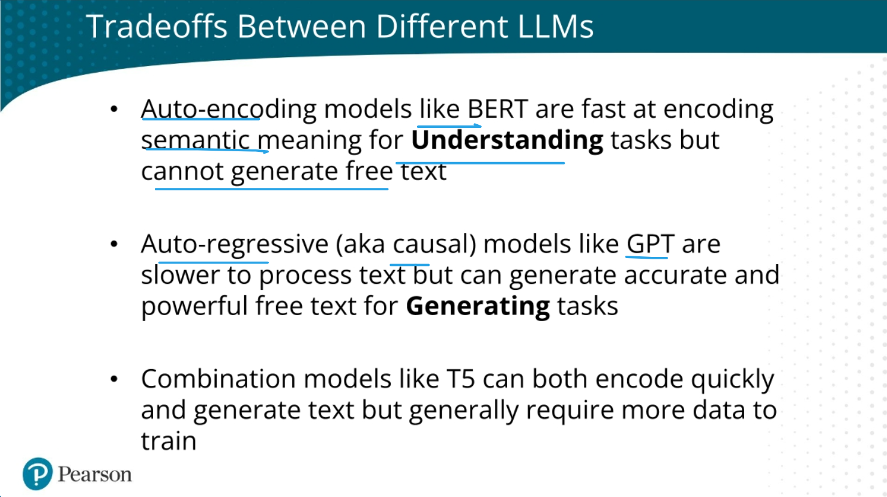

=======================
Artificial Intelligence
=======================

.. highlight:: console

Models Evaluations
==================

- `A holistic framework for evaluating foundation models <https://crfm.stanford.edu/helm/lite/latest/>`__
 

LLM Agents
==========

- `Large Language Models Agents - Anish Shah | DataTalksClub <https://www.youtube.com/watch?v=m5CZzhXPgd0>`__
- `Wandb Colabs <https://github.com/wandb/examples/blob/master/colabs/huggingface/LLM_Finetuning_Notebook.ipynb>`__
- `Building LLM-Powered Apps | Course <https://www.wandb.courses/courses/building-llm-powered-apps>`__

How to Build, Evaluate, and Iterate on LLM Agents
-------------------------------------------------

- `How to Build, Evaluate, and Iterate on LLM Agents | DeepLearningAI <https://www.youtube.com/watch?v=0pnEUAwoDP0>`__
- `Llama-Index Agents + Ground Truth & Custom Evaluations | Codelab <https://colab.research.google.com/github/truera/trulens/blob/main/trulens_eval/examples/expositional/frameworks/llama_index/llama_index_agents.ipynb>`__

DeepLearningAI Courses
======================

Building evaluating advanced RAG
--------------------------------

- `Building evaluating advanced RAG <https://learn.deeplearning.ai/building-evaluating-advanced-rag/lesson/1/introduction>`__

O'Reilly Courses
==================

Large Language Models and ChatGPT
---------------------------------

- Week #1
    - `Class <https://learning.oreilly.com/live-events/large-language-models-and-chatgpt-in-3-weeks/0636920090988/>`__
    - `Slides <../_files/llm_chatgpt_week1.pdf>`_

