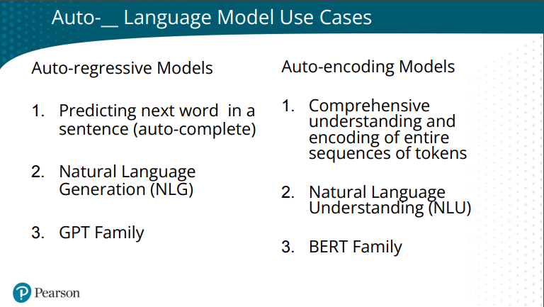

=======================
Artificial Intelligence
=======================

.. highlight:: console

Personas
========

- `Giada Pistilli <https://www.giadapistilli.com/>`__
- `Sinan Ozdemir <https://sinanozdemir.ai/>`__

Companies
=========

- `Prolego <https://www.prolego.com/>`__
- `Phoenix Arize <https://phoenix.arize.com/>`__
- `Zilliz <https://zilliz.com/>`__

Models Evaluations
==================

- `A holistic framework for evaluating foundation models <https://crfm.stanford.edu/helm/lite/latest/>`__
 

LLM Agents
==========

- `Large Language Models Agents - Anish Shah | DataTalksClub <https://www.youtube.com/watch?v=m5CZzhXPgd0>`__
- `Wandb Colabs <https://github.com/wandb/examples/blob/master/colabs/huggingface/LLM_Finetuning_Notebook.ipynb>`__
- `Building LLM-Powered Apps | Course <https://www.wandb.courses/courses/building-llm-powered-apps>`__

How to Build, Evaluate, and Iterate on LLM Agents
-------------------------------------------------

- `How to Build, Evaluate, and Iterate on LLM Agents | DeepLearningAI <https://www.youtube.com/watch?v=0pnEUAwoDP0>`__
- `Llama-Index Agents + Ground Truth & Custom Evaluations | Codelab <https://colab.research.google.com/github/truera/trulens/blob/main/trulens_eval/examples/expositional/frameworks/llama_index/llama_index_agents.ipynb>`__

Miscellaneous Courses
=====================

- `Crème de la crème of AI courses <https://github.com/SkalskiP/courses>`__

DeepLearningAI Courses
======================

Building evaluating advanced RAG
--------------------------------

- `Building evaluating advanced RAG <https://learn.deeplearning.ai/building-evaluating-advanced-rag/lesson/1/introduction>`__

O'Reilly Courses
==================

Large Language Models and ChatGPT
---------------------------------

- Resources:
    - `Class Video <https://learning.oreilly.com/live-events/large-language-models-and-chatgpt-in-3-weeks/0636920090988/>`__
    - `Github Repo <https://github.com/sinanuozdemir/large-language-models-and-chatgpt-in-three-weeks>`__
    - :download:`Slides Week #1 <../_files/llm_chatgpt_week1.pdf>`
    - :download:`Slides Week #2 <../_files/llm_chatgpt_week2.pdf>`
    - :download:`Slides Week #2 <../_files/llm_chatgpt_week3.pdf>`

.. image:: ../_files/tradeoffs_llms.png
  :width: 800
  :alt: Tradeoffs Between Different LLMs

- Recommendations
    * temperature:
    
        * creativity: 1;
        * safe creativity: 0,6;
        * classification: 0,1 (near 0).

- Use Cases
    * BERT: Recommendation systems (EBAY use case);
    * Retrieval Augmented Generation

Hands on NLP with Transformers
------------------------------

- `Class <https://learning.oreilly.com/live-events/hands-on-nlp-with-transformers/0636920063159/>`__
- `Github repository <https://github.com/sinanuozdemir/oreilly-hands-on-transformers>`__

Introduction to Transformer Models for NLP: Using BERT, GPT, and More to Solve Modern Natural Language Processing Tasks
-----------------------------------------------------------------------------------------------------------------------

- `Class <https://learning.oreilly.com/course/introduction-to-transformer/9780137923717/>`__

Hugging Face in 4 Hours
-----------------------

- Resources:
  - `Class <https://learning.oreilly.com/live-events/hugging-face-in-4-hours/0790145056533/0790145056525/>`__
  - `Github Repo <https://github.com/sinanuozdemir/oreilly-huggingface-tour>`__  
  - :download:`Slides Week #2 <../_files/huggingfacein4hours.pdf>`

RAG
==================

- `Generative AI use case: Retrieval Augmented Generation (RAG) <https://www.youtube.com/playlist?list=PL-pTHQz4RcBbz78Z5QXsZhe9rHuCs1Jw->`__
- `Building Production-Ready RAG Applications: Jerry Liu <https://www.youtube.com/watch?v=TRjq7t2Ms5I>`__

AutoGPT
-------

AutoGTP Forge

- `AutoGPT Forge Quickstart <https://github.com/Significant-Gravitas/AutoGPT/blob/master/QUICKSTART.md>`__
- `AutoGPT Forge <https://aiedge.medium.com/autogpt-forge-e3de53cc58ec>`__
- `AutoGPT Forge Research Assistant <https://lablab.ai/t/autogpt-tutorial-creating-a-research-assistant-with-auto-gpt-forge>`__

https://www.gptsportswriter.com/