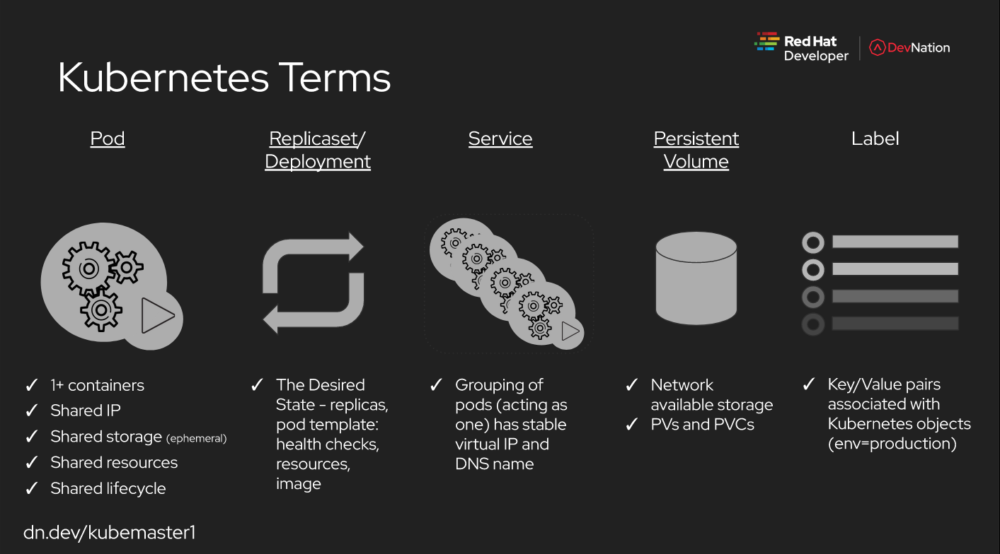

==========
Kubernetes 
==========

.. highlight:: console

Reference
---------

- `Red Hat Kubernetes Tutorial <https://redhat-developer-demos.github.io/kubernetes-tutorial>`__
- `kubernetes.io <https://kubernetes.io/>`__

Terms
-----

Configuration
-------------

- Work with configuration:

::
    
    export KUBECONFIG=~/openshift-installer/gcp/auth/kubeconfig

Namespace
---------

- Create namespace (resource management):

::
    
    kubectl create namespace myspace

- Setting namespace (in order to not specify in every single command):

::
    
    kubectl config set-context --current --namespace=myspace

Or, with openshift (if running):

::

    oc project myspace

Pods
----

- Create pod:

::
    
    cat <<EOF | kubectl apply -f -
    apiVersion: v1
    kind: pod
    metadata:
      name: quarkus-demo
        containers:
        - name: quarkus-demo
          image: quay.io/rhdevelopers/quarkus-demo:v1
    EOF 

- Get list of pods running (in namespace):

::
    
    kubectl get pod

- Enter pod:

::
    
    kubectl exec quarkus-demo -it /bin/bash

- Delete pod:

::
    
    kubectl delete pod <pod>

ReplicaSet
----------

- Create a ReplicaSet:

::
    
    cat <<EOF | kubectl apply -f -
    apiVersion: apps/v1
    kind: ReplicaSet
    metadata:
        name: rs-quarkus-demo
    spec:
        replicas: 3
        selector:
            matchLabels:
               app: quarkus-demo
        template:
            metadata:
               labels:
                  app: quarkus-demo
                  env: dev
            spec:
                 containers:
                 - name: quarkus-demo
                   image: quay.io/rhdevelopers/quarkus-demo:v1
    EOF

- Edit ReplicaSet:

::
    
    kubectl edit rs rs-quarkus-demo

- Describe ReplicaSet:

::
    
    kubectl describe rs rs-quarkus-demo

- Delete ReplicaSet:

::
    
    kubectl delete rs rs-quarkus-demo

Deployments
-----------

- Create a Deployment:

::
    
    cat <<EOF | kubectl apply -f -
    apiVersion: apps/v1
    kind: Deployment
    metadata:
        name: quarkus-demo-deployment
    spec:
        replicas: 3
        selector:
            matchLabels:
               app: quarkus-demo
        template:
            metadata:
               labels:
                  app: quarkus-demo
                  env: dev
            spec:
                 containers:
                 - name: quarkus-demo
                   image: quay.io/rhdevelopers/quarkus-demo:v1
                   imagePullPolicy: Always
                   ports:
                   - containerPort: 8080
    EOF

NOTE: If in production use `imagePullPolicy: IfNotPresent <https://kubernetes.io/docs/concepts/configuration/overview/#container-images>`__

- Get Deployments:

::
    
    kubectl get deployments

- Describe Deployments:

::
    
    kubectl describe deployment <deployment name>

Logs
----

- Get pod logs:

::
    
    kubectl logs <pod name>
    stern <app name

Service
-------

- Create a Service:

::
    
    cat <<EOF | kubectl apply -f -
    apiVersion: v1
    kind: Service
    metadata:
      name: the-service
    spec:
      selector:
        app: quarkus-demo
      ports:
        - protocol: TCP
          port: 80
          targetPort: 8080
      type: LoadBalancer
    EOF

NOTE: Uses labels in order to random requests, via **selector** field.

- Get Services:

::
    
    kubectl get services
    kubectl get service
    kubectl get svc

- Get Endpoints:

::
    
    kubectl get endpoints

Ingress/Expose
--------------

- Create Ingress:

::
    
    cat <<EOF | kubectl apply -f -
    apiVersion: networking.k8s.io/v1beta1
    kind: Ingress
    metadata:
      name: myingress
    spec:
      rules:
      - host: <cluster domain>
        http:
          paths:
          - path: /
            backend:
              serviceName: the-service
              servicePort: 80
    EOF

- Get Ingress:

::
    
    kubectl get ingress

- Delete Ingress:

::
    
    kubectl delete ingress <ingress name>

Ingress has a router/revproxy based on haproxy.

- Expose Service:

::
    
    oc expose svc <service name>

- Get exposed route:

::
    
    kubectl get route
    oc get route

- Delete exposed route:

::
    
    kubectl delete route <service name>

Blue/Green Deployments
----------------------

- Manage pods in service through labels:

::

    kubectl label pod -l app=mypython inservice=mypods
    kubectl label pod -l <label in use> inservice=<inservice name>

NOTE: Service must have a **inservice** *selector*.

- Remove pods in service through labels:

::

    kubectl label pod -l app=mypython inservice-

Operators
=========

- Create an helm operator with a blank chart:

::

    operator-sdk new vis-helm --type=helm --api-version dobtech.io/v1 --kind Visitorsite

- Create an helm operator with an existing helm archive/chart:

::

    operator-sdk new vis-helm --type=helm --api-version dobtech.io/v1 --kind Visitors --helm-chart https://github.com/kubernetes-operators-book/chapters/releases/download/1.0.0/visitors-helm.tgz

- Create an ansible operator with a blank chart:

::

    operator-sdk new vis-ansible --type=ansible --api-version dobtech.io/v1 --kind Visitorsite
